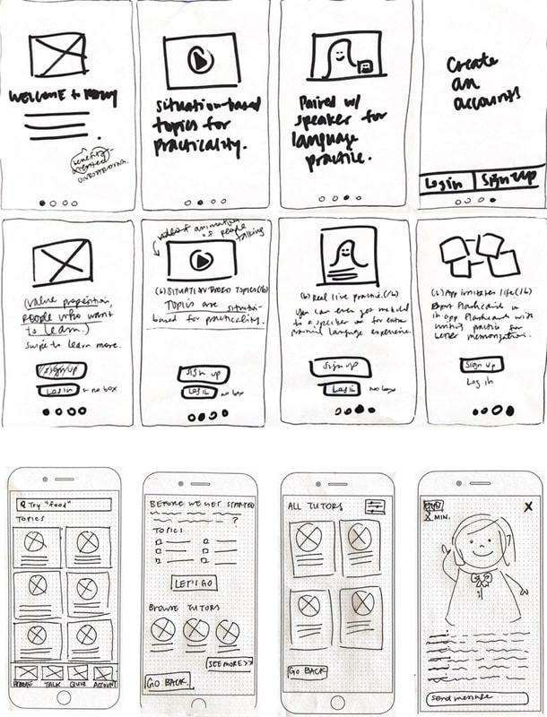

## 🧠 **Introducción al Diseño UX y Diseño de Interfaces UI**

### 1. ¿Qué es UX y qué es UI?

* **UX (User Experience)** — *Experiencia de usuario*:

  * Se refiere a cómo se siente una persona al interactuar con un producto digital.
  * Objetivo: que el usuario complete sus tareas de forma **rápida, fácil e intuitiva**.
  * Incluye: usabilidad, accesibilidad, arquitectura de la información, flujos de usuario.

* **UI (User Interface)** — *Interfaz de usuario*:

  * Es la parte **visual** con la que el usuario interactúa.
  * Incluye: colores, tipografía, botones, iconos, espaciado, jerarquía visual.
  * Es el “look & feel” del producto.

  

---

### 2. Diferencias clave entre UX y UI

| UX (Experiencia)                        | UI (Interfaz Visual)              |
| --------------------------------------- | --------------------------------- |
| Diseño centrado en el usuario           | Diseño visual de la interfaz      |
| Analiza problemas, necesidades y flujos | Aplica estilos, colores y layouts |
| Se basa en investigación y testeo       | Se basa en principios gráficos    |

---

### 3. Principios básicos del diseño UX

* **Claridad**: que todo se entienda rápido.
* **Consistencia**: que las cosas funcionen igual en toda la app/web.
* **Accesibilidad**: que cualquier persona pueda usarlo, incluso con limitaciones físicas.
* **Feedback**: que la interfaz responda a las acciones del usuario.
* **Jerarquía visual**: mostrar qué es más importante en cada pantalla.

---

### 4. Buenas prácticas de UI

# 🛠️ Herramientas para evaluar diseño UX/UI

# 🎨 Contraste entre fondo y texto

### 🛠️ Herramientas
- [WebAIM Contrast Checker](https://webaim.org/resources/contrastchecker/)
- [Color Contrast Analyzer (TPGi)](https://www.tpgi.com/color-contrast-checker/)
- [Accessible Colors](https://accessible-colors.com/)

### 🌟 Ejemplos
**✅ Buena práctica:**
- [Apple](https://www.apple.com/)
  - Usa contrastes fuertes en títulos y botones, con fondo claro u oscuro según contexto.

**❌ Mala práctica:**
- [Yale School of Art](https://www.art.yale.edu/)
  - Usa tipografías con bajo contraste y fondos que dificultan la lectura.

---

# 🌈 Uso coherente de colores y tipografías

### 🛠️ Herramientas
- [Coolors](https://coolors.co/): para generar y guardar paletas de colores.
- [Google Fonts](https://fonts.google.com/): combina tipografías y revisa su estilo y peso.
- [Fontjoy](https://fontjoy.com/): genera combinaciones tipográficas compatibles.
- [CSS Stats](https://cssstats.com/): analiza tu hoja de estilos y detecta inconsistencias en colores y tipografías.

### 🌟 Ejemplos
**✅ Buena práctica:**
- [Stripe](https://stripe.com/)
  - Colores consistentes en toda la interfaz y tipografías modernas, legibles y jerarquizadas.

**❌ Mala práctica:**
- [Ling's Cars](https://www.lingscars.com/)
  - Sobrecarga visual con demasiados colores chillones y múltiples fuentes sin jerarquía.

---

# 🔘 Tamaño y visibilidad de botones

### 🛠️ Herramientas
- [Fitts's Law Calculator](https://touchlab.co/fitts/): mide accesibilidad y usabilidad de botones.
- [Material Design Guidelines – Buttons](https://m3.material.io/components/buttons/overview): buenas prácticas de tamaño y uso.
- [Contrast Grid](https://contrast-grid.eightshapes.com/): compara botones con colores de fondo.

### 🌟 Ejemplos
**✅ Buena práctica:**
- [Dropbox](https://www.dropbox.com/)
  - Botones bien ubicados, de tamaño adecuado y con buen contraste respecto al fondo.

**❌ Mala práctica:**
- [Pacific Northwest X-Ray Inc.](https://www.pnwx.com/)
  - Botones poco visibles, demasiado pequeños y sin diferenciar de otros elementos.

---

# 📏 Espaciado visual

### 🛠️ Herramientas
- [Modulz / Radix Themes](https://www.radix-ui.com/themes): define spacing system con diseño coherente.
- [8pt Grid System](https://8ptgrid.guide/): guía para usar un sistema modular de espaciado.
- [Paddi](https://paddi.app/): visualiza y ajusta padding/margin en tus diseños.

### 🌟 Ejemplos
**✅ Buena práctica:**
- [Notion](https://www.notion.so/)
  - Gran uso de espacio en blanco, separación clara entre secciones y bloques de texto.

**❌ Mala práctica:**
- [Penny Juice](http://www.pennyjuice.com/)
  - Diseño saturado, con márgenes inexistentes y bloques apelotonados.

---

# 🧠 Iconos comprensibles

### 🛠️ Herramientas
- [Noun Project](https://thenounproject.com/): biblioteca de iconos con etiquetas claras.
- [Material Icons](https://fonts.google.com/icons): estándar para sistemas Android y web.
- [Icon Accessibility Guidelines](https://www.w3.org/WAI/tutorials/images/icons/): buenas prácticas para iconos accesibles.
- [Heroicons](https://heroicons.com/): iconos limpios y legibles, ideales para acompañar texto.

### 🌟 Ejemplos
**✅ Buena práctica:**
- [Airbnb](https://www.airbnb.com/)
  - Usa iconos simples y siempre acompañados de texto en menús y filtros.

**❌ Mala práctica:**
- Webs de apps sin etiquetas (algunas interfaces móviles como Instagram Reels en sus inicios)
  - Iconos sin texto que no explican su función hasta que el usuario prueba por ensayo y error.

---

### 5. Herramientas comunes

* **Wireframes**: bocetos simples de las pantallas.
* **Mockups**: diseño más detallado y visual.
* **Prototipos**: versión interactiva que simula la app real.
* Herramientas: *Figma*, *Adobe XD*, *Canva*, *Balsamiq*, papel y lápiz.

---

- [Introducción al UX](./intro-ux.md)
- [Introducción al UX - Parte 2](./intro-ux-2.md)
- [Introducción al UI](./intro-ui.md)
- [Glosario](./glosario.md)